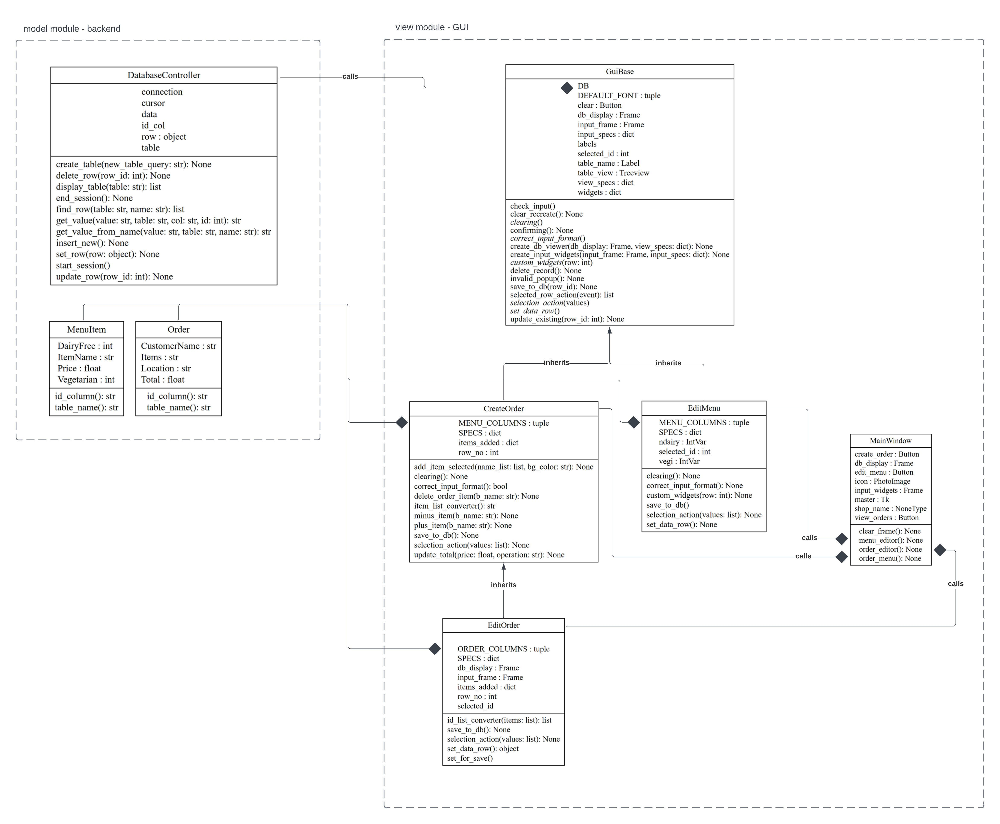

.. Sandwich shop 710069439 documentation master file, created by
   sphinx-quickstart on Wed Mar 15 20:05:50 2023.
   You can adapt this file completely to your liking, but it should at least
   contain the root `toctree` directive.

Welcome to Sandwich shop 710069439's documentation!
==================================================

.. toctree::
   :maxdepth: 2
   :caption: Contents:

Indices and tables
==================

* :ref:`genindex`
* :ref:`modindex`
* :ref:`search`

Download and setup instructions
===============================

Installing and running sandwich_shop app:
-----------------------------------------
- Download zip file
- Extract all files into an accesible file location
- On your command line interface run:
   ``python -m pip install -e C:/Users/YOUR_DOWNLOAD_LOCATION/sandwich_shop``
- To launch the app run:
   ``python C:/Users/YOUR_DOWNLOAD_LOCATION/sandwich_shop/code/main.py``

Running the app from within the package:
----------------------------------------
- Open the sandwich_shop folder in an IDE such as Visual Studio Code from the root directory 'sandwich_shop'
- Run the terminal and check that the file path ends with 'sandwich_shop'
- Install the package by running the command ``python -m pip install -e .``
- To launch the app run:
   ``python ../sandwich_shop/code/main.py``
- OR go to sub-directory 'code', go into the module main.py, run the file
- OR in a python file, add the following lines and run the file:

.. code-block:: python

   from sandwich_shop.code import main
   main.run()

UML Class Diagram
=================

